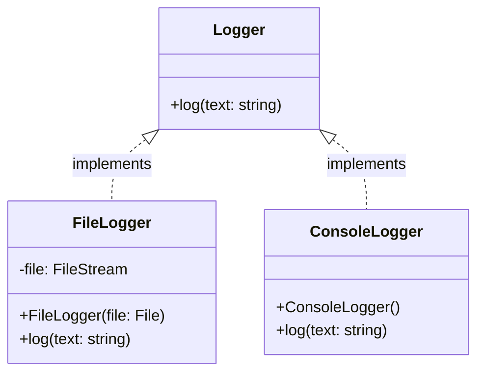

## What Dependency Injection?

Dependency Injection (consequently referred to as DI) is a design pattern used in object-oriented programming as a form of inversion of control. It allows dependencies to be provided without the dependent class having to know how to create them.

### DI Container

A DI-Container is used to store and resolve all the dependencies. You might use one global DI container or multiple. That depends on the project and the framework (if you use a framework).

### Services

Everything that is registered to or provided from a DI container is called service. A service might be a class or an interface.

### Registration types

Some DI libraries provide more, but the main types are:

#### Singleton

A new Service is created only once during the DI container's lifetime, and used everywhere.

#### Transient

The DI container creates a new instance of the service, every time it is requested.

#### Scoped

What a scope is depends on the framework of your project.

A new instance is created for every scope. Within this scope, the existing instance is reused.

## Examples

### ASP.NET Core (C#)

```cs
var builder = WebApplication.CreateBuilder(args);
builder.Services.AddSingleton<Logger>(
	sp => new FileLogger(File.CreateText(@".\log.txt"))
);
var app = builder.Build();
```

#### Koin (Kotlin)

```Kotlin
val appModule = {
	single<Logger> {
		FileLogger(File("./log.txt"))
	}
}

startKoin {
	modules(appModules)
}
```

## Why though?

You might have a class called `HttpHandler` that handles HTTP requests. It would be a good idea to use a logger to track any requests or errors in that class. You could just create a new instance of something like a `FileLogger` and pass the file where you want it to store the logs.

But there is one question: **Why does the `HttpHandler` has to know where to store its log files? A class should only have one responsibility. Handling log files is definitely not the responsibility of a `HttpHandler`!**

You would rather request a `FileLogger` instance from the DI container. Then there is no logic inside the `HttpHandler` on how to create this logger.

You could even go one step further and create an interface `Logger` which is implemented by the `FileLogger` class. If you request an instance of the `Logger` interface, the DI container will provide an instance of a class implementing this interface. In our case, this would be `FileLogger`.

You could then switch to another implementation like a `ConsoleLogger` without changing any code that uses a logger. This works because the `HttpHandler` relies on the abstraction (interface) and not on any specific implementation.



This also follows the Liskov Substitution and Dependency Inversion principles because it doesn't matter which implementation of the interface is used. It kind of forces you to provide the needed methods and fields in the interface. You could even use a child class of the `ConsoleLogger` that writes to another console using something like [screen](https://wiki.ubuntuusers.de/Screen). The dependent class only calls the `log` method to log a message, it doesn't care how this logging is done.

## Where is this used?

The architectural pattern MVVM needs DI if there is communication between multiple viewmodels and models which are not directly related. This scenario occurs in 99% of every MVVM application. Because they need to be able to communicate in order to make it one whole app instead of multiple unrelated screens.

Those popular frameworks provide a build in DI solution:
- [ASP.NET Core](https://learn.microsoft.com/en-us/aspnet/core/fundamentals/dependency-injection)
- [Xamarin](https://learn.microsoft.com/en-us/xamarin/xamarin-forms/enterprise-application-patterns/dependency-injection)
- [MAUI](https://learn.microsoft.com/en-us/dotnet/architecture/maui/dependency-injection)
- [Angular](https://angular.io/guide/dependency-injection)

Other DI libraries you could use:
- [Koin](https://insert-koin.io) (Kotlin)
- [Dagger](https://dagger.dev) (Kotlin)
- [Google Fruit](https://github.com/google/fruit) (C++)
- [Spring](https://docs.spring.io/spring-boot/docs/2.0.x/reference/html/using-boot-spring-beans-and-dependency-injection.html) (Java)
- [Unity](https://github.com/unitycontainer) (C#)
